# README for Sacred Pathways Project

## Contents
- [Contents](#contents)
- [Introduction](#introduction)
- [Purpose](#purpose)

- [Design](#design)
  - [Wireframe](#wireframe)
  - [Sketches Of The Sacred Pathways Project](#sketches-of-the-sacred-pathways-project)
  - [Color Scheme](#color-scheme)
  - [Typography](#typography)
  - [Imagery](#imagery)
  - [Features](#features)
    - [Existing Features](#existing-features)
    - [Home page](#home-page)
      + [Meditation Section](#meditation-section)
      + [Mindfulness Section](#mindfulness-section)
      + [Yoga Section](#yoga-section)
    - [Community \& Support Page](#community--support-page)
    - [Accessibility](#accessibility)
- [Technologies Used](#technologies-used)
  - [Languages Used](#languages-used)
  - [Frameworks, Libraries \& Programs Used](#frameworks-libraries--programs-used)
- [Deployment](#deployment)
- [User Stories](#user-stories)
  + [User Story 1](#user-story-1)
  + [User Story 2](#user-story-2)
  + [User Story 3](#user-story-3)
  + [User Story 4](#user-story-4)
  + [User Story 5](#user-story-5)
- [Testing and Solved](#testing-and-solved)
- [Validator and Testing](#validator-and-testing)
- [Full Testing](#full-testing)
- [Credits](#credits)
  + [Code Used](#code-used)
  + [Content](#content)
  + [Media](#media)
  + [Acknowledgement](#acknowledgement)

## Introduction

Welcome,

This website is a sanctuary dedicated to the transformative power of meditation, mindfulness, and yoga. Here, we invite you to embark on a journey towards finding purpose and balance in your life by nurturing your body, mind, and soul. In the midst of our fast-paced and often chaotic world, it is easy to lose sight of our true selves and the deeper meaning that lies within us. However, through these ancient practices, we can rediscover our inner peace, cultivate self-awareness, and unlock our fullest potential. Whether you are a beginner or an experienced practitioner, our intention is to provide you with the tools, guidance, and inspiration to embark on a path of self-discovery and personal growth. Join our community and let us help you create a life filled with authenticity, joy, and a profound sense of purpose.

## Purpose

Sacred Pathways, we are dedicated to guiding you on a transformative journey towards inner peace and self-discovery. Our website is a sanctuary for those seeking harmony of mind, body, and soul through the profound practices of meditation, mindfulness, and yoga.

We invite you to explore our website, to immerse yourself in the teachings and practices we offer, and to embark on a path of self-discovery and personal growth. Together, let us create lives filled with authenticity, joy, and a profound sense of purpose. Welcome to a world of body, mind, and soul experiences that will guide you towards a life of greater meaning and fulfillment.

# Design

## Wireframe

This is basic sketch and spacial planning of the project using Balsamiq. Below is the structure giving a layout of the Main page which will have the logo on the left, the menu on the right, main image at the lop below the header and showing the various sections of the website which will be Meditation, Minfulness and Yoga. The next page is the Community and Support which will have the form for contacting Sacred Pathways, providing feedback and also additional resources for advance exploration and learning on each of the practices.

## Sketches Of The Sacred Pathways Project

The Sections will be Landing Sections/Home, Meditation, Mindfulness, Yoga. The Community and support will be a separate html page where people can sign up, provide feedback or get linked to recommended resources such as other websites that can assist or guide them through advance meditation, mindfulness. Page 2 is the Community and support page.

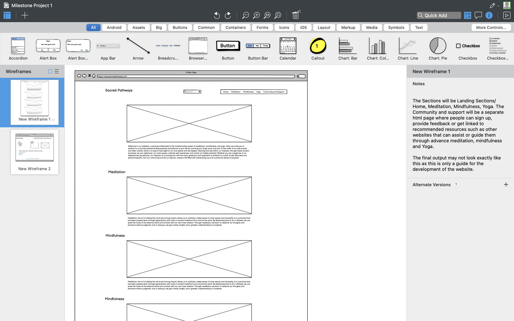

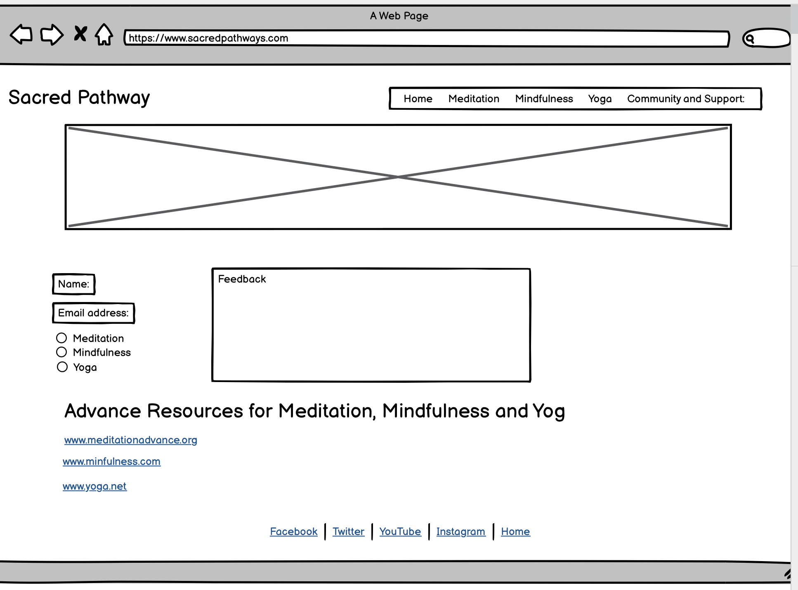

## Color Scheme

The color scheme was carefully selected to reflect the calm and natural environment that suits the theme of meditation, mindfulness and yoga.

The color scheme used is a mainly white background with natural feel, violet, orange, gray and light blue touch.

The colour palette of the website was generated using Colormind and the palette is shown below:

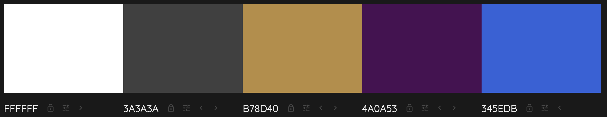

## Typography

Google Fonts was used for this website.

Lato for the headings and Oswald for the body text and sans-serif in replacement.

## Imagery

The website uses to depict the theme of meditation, minfulness and yoga. The homepage image which serves as the landing page is carefully selected to reflect the theme. Two images are selected for each of the sections of meditation, mindfulness and yoga. The community and support page also has an image carefully selected to reflect a community of practitioners supporting each other.

## Features

The website has two pages of home page with three sections of meditation, minfulenss and yoga. The send page is for communiuty and support. The features of the home page include logo on the left and navigation elements of the menu on the right with Home, Meditation, Mindfulness and Yoga which navigates you to the corresponding section of the page with images adn content. The Community and Support nmenu takes you to the Comnmunity and Support page. The home image is designed to give a 5 seconds zoom forward effect to attract attention.

On the home image is a cover text with orange transparent backround drawing your attention to the purpose of the website.

Below the home image is the section on Meditation with introductory text and two images of meditation and steps in meditation to guide people into meditation. The mindfulness and yoga sections, similarly has the same structure as meditation section with section heading, introductory text, two images and steps in mindfulness and yoga respectively.

The Community and support page maintains the same page structure of logo, menu and footer but a hero's image to reflect a community of practitioners supporting each other. It has additional resources for people who want to explore more of these topics and forms for feedback and sending an email request to Sacred Pathways. The fields for feedback and request and required and also once a message or request is sent, an automatic response that indidcates that your feedback or request is succesfully received is provided.

The footer has the social media links that opens in different tabs.

### Existing Features

Both pages of the webiste has the following features:

- Logo
  The logo on the top left corner of the page which is anchored to bring you to the home page once clicked.

- Navigation bars
  Fully responsive navigaton bars that jumps you to the section of the corresponding section of the page or another page depending on on the selected menu.

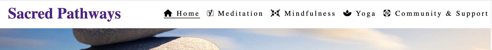

- Footer
  The footer has the social media links and also the copyright statment. The social media links are represented with icons with anchor elements that opens in different tabs when clicked in order to not distract users in the main site.

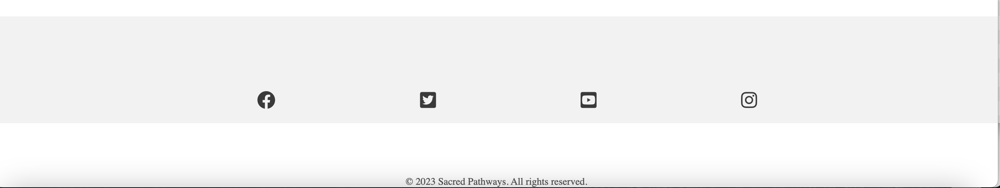

### Home Page

- The Home page has the home image of the website should evoke a sense of tranquility and calmness. The colors used in the image depicts soothing and harmonious, such as soft greens, blues, or earthy tones. The image is gentle and has inviting vibe, encouraging visitors to explore the website further and engage in practices that promote relaxation, self-awareness, and well-being.

- The cover text is overlaid on the home image with theme of the website in a transparent orange background

- The home image and cover text is given a 10% foward zoom effect to make it appealing to visitors and catch attention.

#### Meditation Section

The meditation section starts with a header and icon from fontawesome to depict meditation. It follows with an introductory paragraph to meditation and an 2 images of meditation. The images have alt text for assisted technology to describe the image and also a decriptive text of the images under the images. These images are carefully chosen with calm and natural backgrounds to depict the theme.

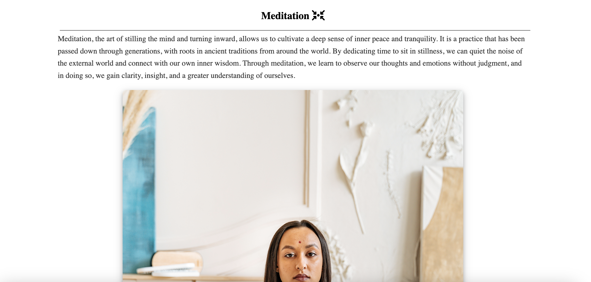

- Steps in Meditation
  This is a sub section of the meditation section which gives basic steps to follow to begin the practice of meditation. This is no way an exhaustive guide but only to provide a basic initiation of users to meditional and additional resources are provided to visitors who are interested in taking it further.

  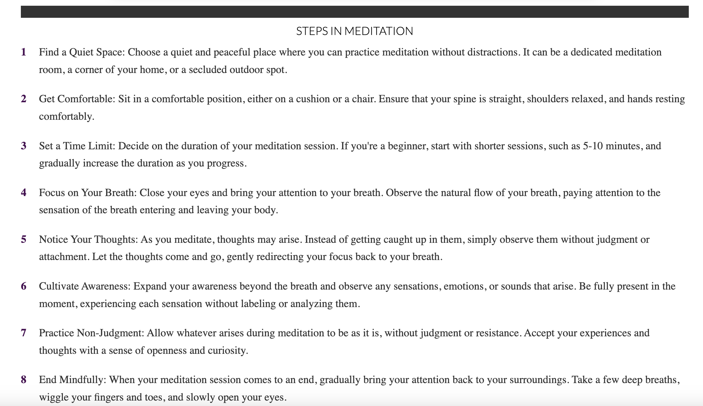

### Mindfulness Section

The Mindfulness section starts with a header and an icon from fontawesome that represnts mindfulness. There is an introductory paragraph and 2 images, one in indoor settings with candlelight and the other in natural green environment. These images have alt descriptive text for assisted technologies for visually impaired users.

- Steps in Mindfulness
  This is a sub section of the mindfulness section giving basic steps to follow for those that are interested in mindfulenss. Additional resources are provided in the additional resouces sector on the community and support page for those that are interested in exploring more.

  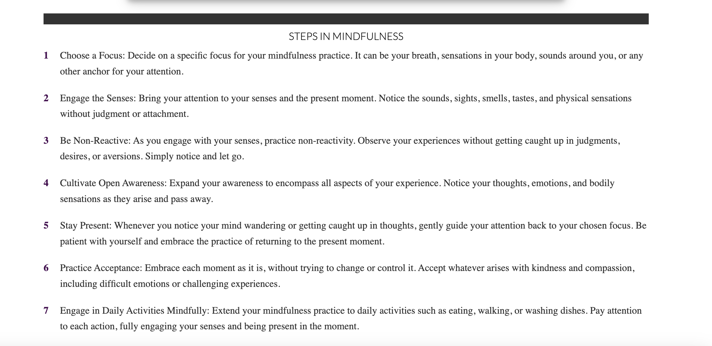

### Yoga Section

The Yoga section as well starts with a header and an icon that represents yoga. This is followed by an introductory paragraph and two images of a group of people in yoga practice. The images have descriptive text both under the images and also in alt for assisted tecnology for machine reading for visually impaired users.

- Steps in Yoga
  This is a sub section of the Yoga section with basic steps to follow in yoga practice for users. Additional resouce is provided at the community and support page for those that are interested in exploring more on yoga.

  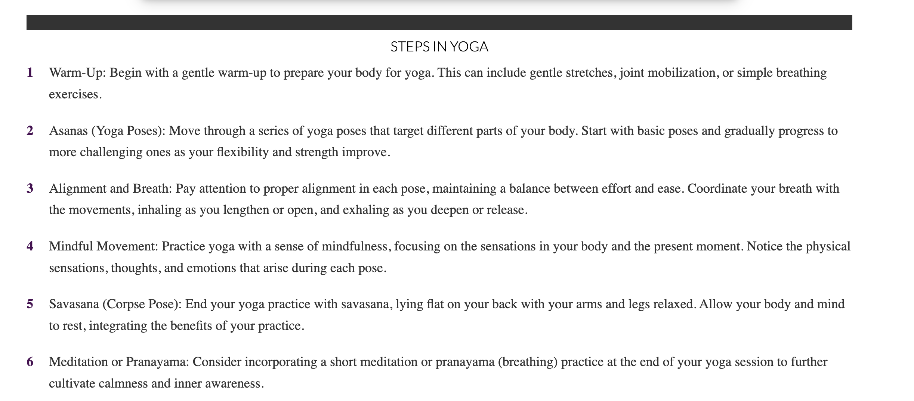

### Community & Support Page

    The community and support page share the navigation menu and footer like the home page. It has a different hero image. The hero image here is an image of a community of practitioners supporting each other carefully selected to represent the theme of the website. It also has a cover text in an transparent orange background enjoining users to join the discussion on body, mind and soul.

- Additional Resources Section
  This is a section that provides list of resouces that users can explore for more on meditation, mindfulenss and yoga.

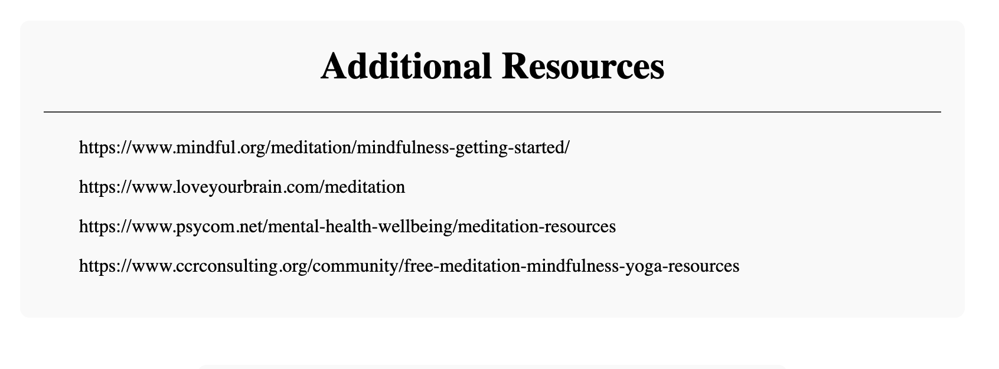

- Feedback Form
  This is a form that has fields for Name, email and message from the user. These fields are required and therefore users cannot send an empty field, once feedback is sent a submit page indicating to you that you have succefully sent a feedback.

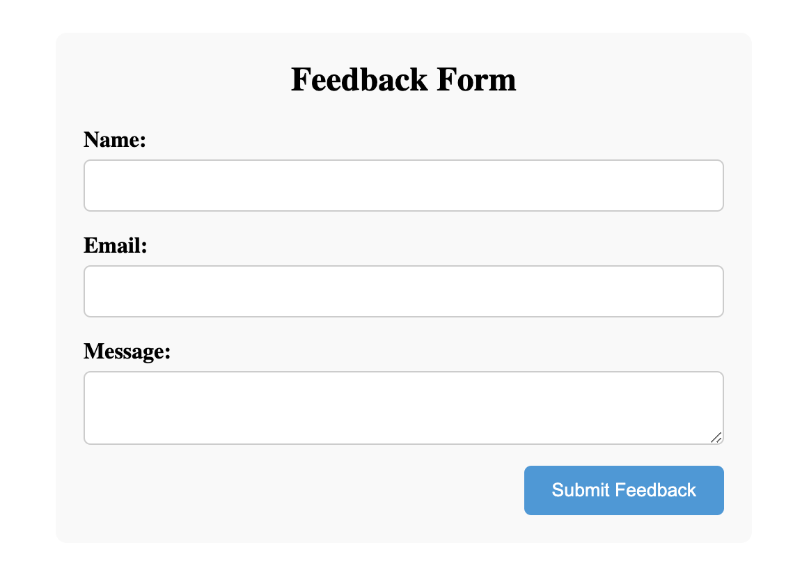

- Request From
  This is a request form for users who have additional request for information or any speicial request. The fields are required, you have to input your email and you request message and then send. You will recieve an submit message that indicates that you have successfully sent a request.

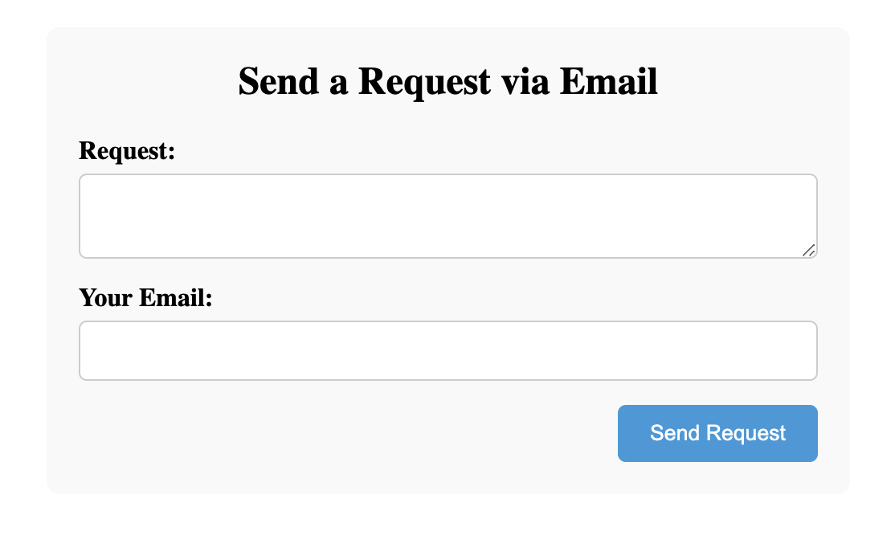

- Meeting Times Section
  This is a section giving the days and times for meditation, mindfulness, yoga and coffee meetings and the venues for these meetings.

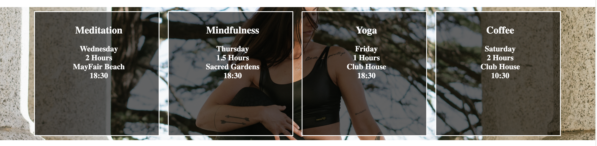

### Accessibility

The website is made accessible-friendly as possible through the following measures:

- Utilizing semantic HTML to provide meaningful structure and enhance accessibility.
- Incorporating descriptive alt attributes for images on the site to provide alternative text for screen readers.
- Ensuring an adequate color contrast across the site to improve readability for users with visual impairments. I employed the contrast checker provided by WebAIM to validate the contrast ratio between the selected foreground color and background color.
- Making menus accessible by indicating the current page as "current" for screen readers, aiding navigation and orientation.

By implementing the above measures the over all accessibiity of the website is enhanced.

## Technologies Used

### Languages Used

    This project was created using only HTML and CSS.

### Frameworks, Libraries & Programs Used

    Codeanywhere was used to create the codes and GitHub was used to create the repository for storage of the codes created in codeanywhere.

    In the final stages of the work, my Codeanywhere account was suspended for lack of workspace hours and therefore Gitpod was used to complete the work. This decision was timely and based on the advised of my wondeful mentor.

    GitHub was also used to share to share work with my mentor for review and for deployment of the website.

    Google Fonts were used in creating the website.

    Icons used in the website were taken from Font Awesome free icons.

    Images were taken from pexels.com free istock photos. All the images, home image, hero image and the images for meditation, mindfulenss and yoga were taken from pexels.com.

    The Google Dev Tools was used identify bugs and for debugging and to test responsiveness of the website to different screen sizes.

    Am I Responsive was used to check the various device breakpoints for responsive design. The page below shows the snapshots from Am I Responsive for the 2 pages of the website:

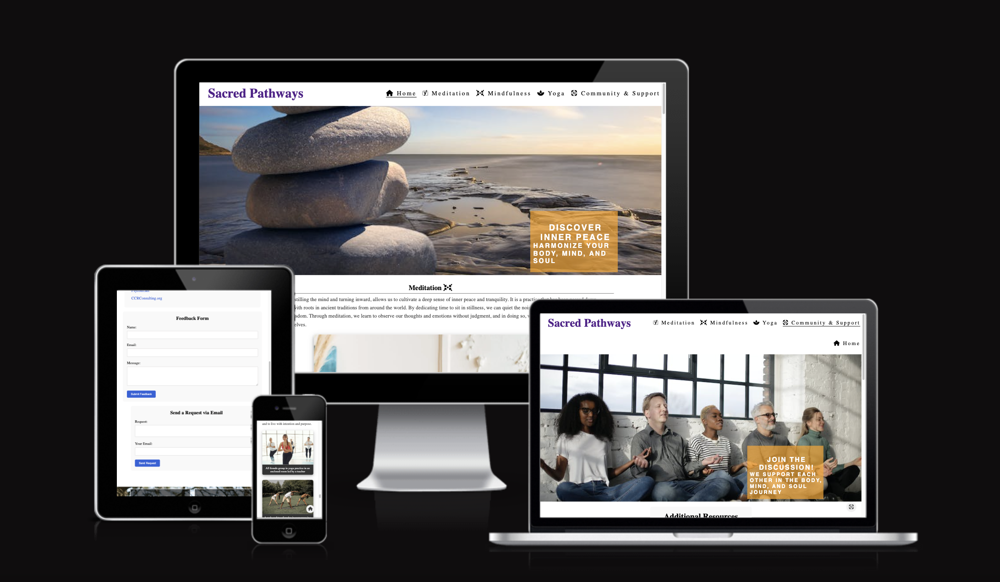

    WAVE Evaluation tool was used to evaluate web accessibility within the browser.

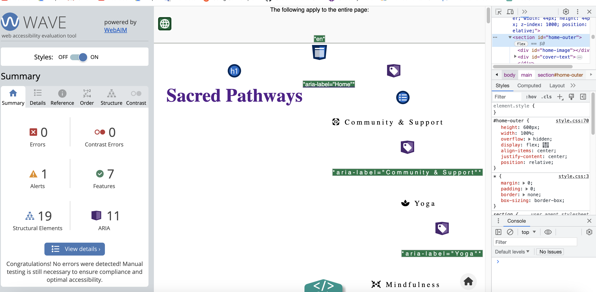

    Unicorn Revealer was used to check overflow on the website. This was very useful in checking the overflow from menu navigation, sections, forms and footer.

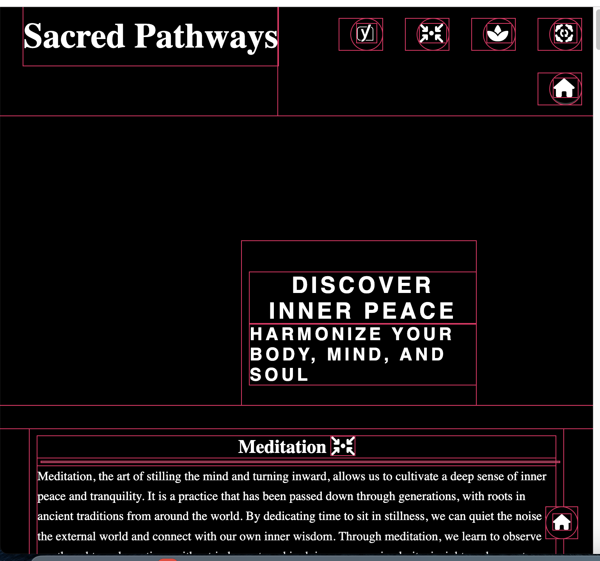

  Chrome Lighthouse was used to analyzed both pages of the website with the following results as shown in the snapshots of the reults:

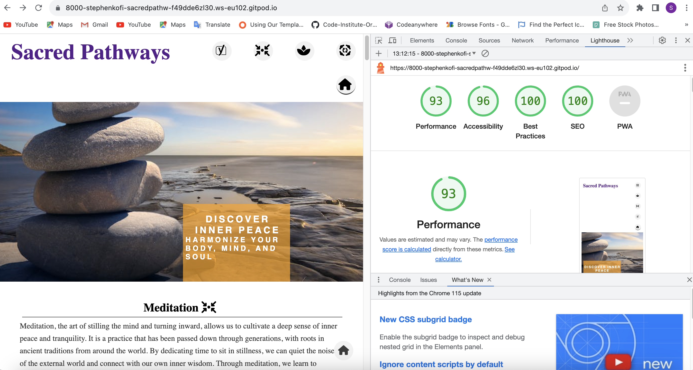

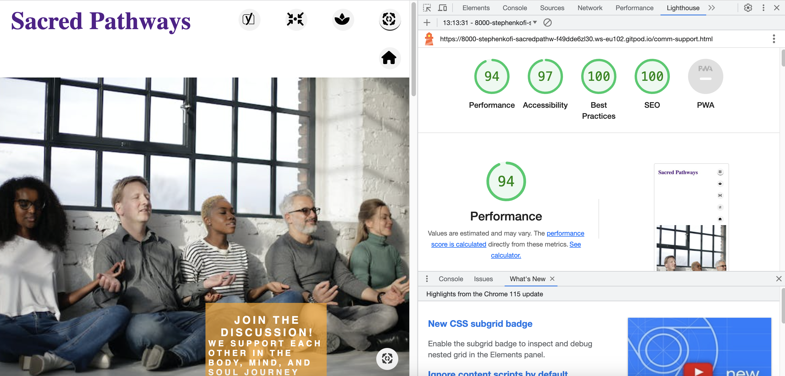

## Deployment
  The depoymnent was done very early on in the project based on advice from my mentor.
  The deployment of the project was done in the following steps:

  -  Forking the repo: The repository was created in GitHub by forking a copy from the original Code Institute repo template. This was done on GitHub by clicking the "Fork" button to create a copy of the original repository.
  - Launching in IDE: After forking the repository, it was cloned or copied into Codeanywhere and opened by creating a new workspace. 
  - Git add/commit/push to GitHub: With the project open in your Codeanywhere, changes were made to the codebase and after desired changes, Git commands to stage the modified files (git add), create a commit with a descriptive message (git commit), and push the changes to your forked repository on GitHub (git push) were done.
  - Settings: In the repository's settings on GitHub, the configuration of the branch from the main was done for deploymnent to setup up the branch for deployment.
  - Pages: GitHub Pages which has the facility to host your website directly from my GitHub repository was utilized. This was enabled in GitHub Pages by navigating to the repository's settings and locating the "GitHub Pages" section. Here, the branch to deploy was configured of the website's domain as required.
  - Choosing a branch & deploying: In the GitHub Pages settings, a selection of the branch that contains the code of the website. GitHub then built and deployed the website using the code from the selected main. The following deployment address was created from which the website can be accessed:
  
   [Sacred Pathways](https://stephenkofipoku.github.io/Sacred_Pathways_Project_1/)

## User Stories

    The user stories are feedback and stories from user and vistors of Sacred Pathways about what draws them to the website and why they will revisit or recommend it to others. The following are stories shared by users of all ages. We have users from different professional backgrounds and age groups who visit the website for diffent reasons.

### User Story 1

    Name: Alex (Male, Software Engineer)
    Background: Alex works as a software engineer in a fast-paced tech company. He often feels stressed and mentally exhausted due to the demanding nature of his job. Seeking ways to find inner peace and balance, Alex discovers Sacred Pathways. The website's comprehensive resources on meditation, mindfulness, and yoga resonate with him. He visits the site regularly to practice guided meditation sessions, which helps him reduce stress and improve his focus at work. Alex appreciates the user-friendly design and engaging content, making him recommend Sacred Pathways to his colleagues who are also seeking relaxation techniques. The navigation links and homing incons make the website so interactive, responsive and user-friendly.

### User Story 2

    Name: Sarah (Female, Yoga Instructor)
    Background: Sarah is a dedicated yoga instructor with a passion for sharing the benefits of yoga with others. She comes across Sacred Pathways during her research for new yoga sequences and teaching methods. Impressed with the yoga section of the website, she finds creative ideas and inspiration to incorporate into her classes. Sarah appreciates the curated resources and in-depth articles, which deepen her understanding of yoga philosophy. She visits Sacred Pathways regularly to access new content and participates in the yoga sessions to connect with like-minded individuals. As a yoga enthusiast and instructor, she happily recommends the platform to her students and fellow instructors. The calming and natural colors of the webisite make it so attractive.

### User Story 3

    Name: David (Male, Spiritual Seeker)
    Background: David is a spiritual seeker exploring various meditation and mindfulness practices. He discovers Sacred Pathways while searching for a comprehensive platform that aligns with his spiritual beliefs. The website's inclusive approach and diverse resources resonate with him deeply. David finds solace in the guided meditation sessions, and the articles on mindfulness enrich his understanding of the practice. As he deepens his spiritual journey, David often revisits Sacred Pathways to explore different aspects of meditation and mindfulness. He appreciates the platform's respectful approach to different belief systems and happily shares the website with his spiritual community.

### User Story 4

    Name: Emily (Female, Busy Working Professional)
    Background: Emily is a busy working professional with a hectic schedule. She struggles to find time for self-care and maintaining a work-life balance. A friend recommends Sacred Pathways, and Emily decides to explore it. The short mindfulness exercises and quick yoga sessions fit perfectly into her daily routine. The website's accessibility and mobile-friendly design allow Emily to access resources on-the-go, during breaks or while commuting. The platform becomes her go-to destination for finding moments of calm amidst her busy life. Emily shares Sacred Pathways with her colleagues, understanding that it could be a valuable resource for anyone juggling a demanding career.

### User Story 5

    Name: Michael (Male, Athlete)
    Background: Michael is a professional athlete who seeks ways to enhance his performance and mental focus. After reading about the benefits of meditation and mindfulness for athletes, he stumbles upon Sacred Pathways. The platform's meditation techniques for athletes, combined with yoga for physical flexibility, intrigue him. Michael incorporates these practices into his training routine and experiences improved concentration and relaxation during competitions. Impressed with the positive impact on his athletic performance, Michael recommends Sacred Pathways to his teammates and coaches. He finds value in the specialized content catered to athletes, making him return to the website regularly to enhance his sports performance and well-being.

## Testing and Solved

| **TEST**                                        | **ACTION**                                                      | **EXPECTATION**                                                                                      | **RESULT**        |
| ----------------------------------------------- | --------------------------------------------------------------- | ---------------------------------------------------------------------------------------------------- | ----------------- |
| Home page                                       | Using Chrom Dev Tools size to 1920px                             | Elements and flow looks good @ 950px and down                                                        | Works as expected |
| Home page                                       | Using Chrom Dev Tols size to 320px                              | Elements and flow looks good @ 320px and down                                                        | Works as expected |
| Hero page - Community & Support                 | Using Chrom Dev Tools size to 950px and down and 320px and down | Elements and flow looks good at 950px and down and 320px and down                                    | Works as expected |
| Nav bars - Home page                            | Click nav menu buttons                                          | Each nav element takes you to the correction section or page                                         | Works as expected |
| Floating Nav icons - Home and Community Support | Click on the floating icon                                      | Each takes you to the top of the corresponding page                                                  | Works as expected |
| Menu Icons                                      | Using Chrom Dev Tools size to 950px and down                    | Menu text hidden but icons appear                                                                    | Works as expected |
| Forms - Feedback and Request                    | Send feedback or request with wrong data or missing data        | Fields must be correctly completed as required                                                       | Works as expected |
| Forms - Feedbdack adn Request                   | Correctly complete and send a feedback or request               | A code Insitute message page indicating to you that you have successfully sent a feedback or request | Works as expected |
| Footer - Social media links                     | Click on social media links or icons                            | A new tab opens to the social media page                                                             | Works as expected |

On the advice of my mentor, Lauren-Nicole, aria labels were added to all anchor tag. Also content between header & footer were wrapped in opening/closing set of main tags. 

Flexbox was employed upon the suggestion of my mentor during the first session of the project. This was to improve on responsivement and to reduce on the number of media queries to make all sections responsivie.

The back to top button was also implemented as a suggestion by my mentor to improve on interaction and responsiveness.

## Validator and Testing

- HTML: No errors were returned when passing through the official W3C validator.
  - The Home page HTML
  - The Community & support page HTML

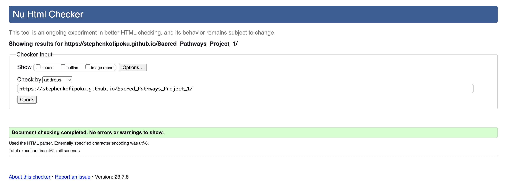

- CSS: No errors were found when passing through the official Jigsaw validator.
  - style.css

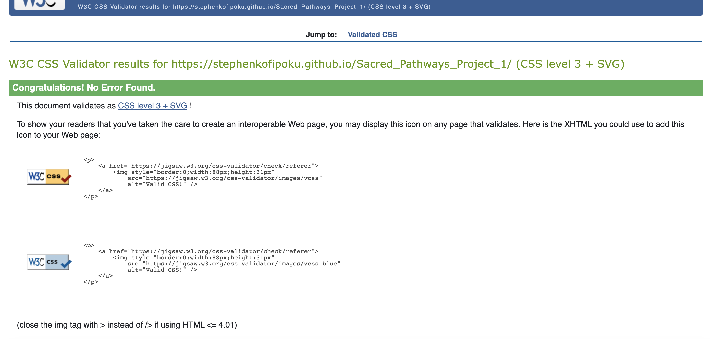

## Full Testing

    Website has been tested on different devices and browsers to ensure maximum functionality.

## Credits

### Code Used

- Inspiration was taken from the structural design of LoveRunning source code from Code Institute.
- README.md template from Code Institute.
- Form dump from Code Institute used.

### Content

- The content of the website was written by Stephen Opoku
- Some additional content for the paragraphs and text sections were written with the help of ChatGPT, an AI language model developed by OpenAI.
- ChatGPT was very helpful in editing of my my codes.

### Media

- All images were taken from https://www.pexels.com/
- Icons from https://fontawesome.com/

### Acknowledgement

- My family for the support and encouragement through this project
- My mentor, Lauren-Nicole for her valuable input and guidance on this project. Super grateful to her.
- Code Institue Tutor Support for saving my work at a critical time.
