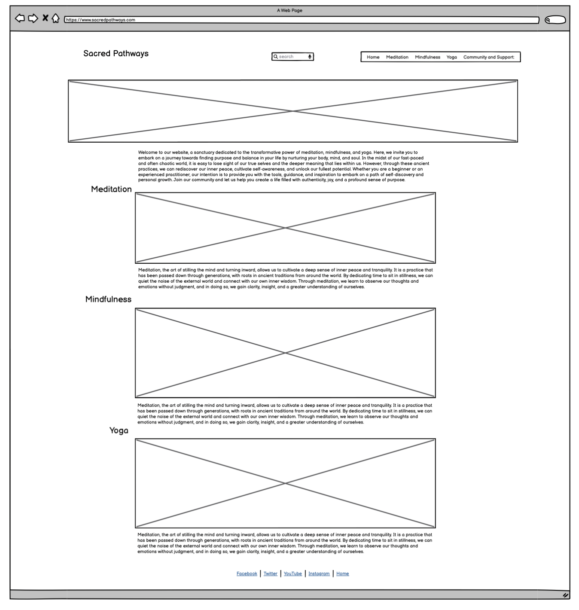

# README for Sacred Pathways Project

## Introduction

Welcome,

This website is a sanctuary dedicated to the transformative power of meditation, mindfulness, and yoga. Here, we invite you to embark on a journey towards finding purpose and balance in your life by nurturing your body, mind, and soul. In the midst of our fast-paced and often chaotic world, it is easy to lose sight of our true selves and the deeper meaning that lies within us. However, through these ancient practices, we can rediscover our inner peace, cultivate self-awareness, and unlock our fullest potential. Whether you are a beginner or an experienced practitioner, our intention is to provide you with the tools, guidance, and inspiration to embark on a path of self-discovery and personal growth. Join our community and let us help you create a life filled with authenticity, joy, and a profound sense of purpose.

## Purpose

Sacred Pathways, we are dedicated to guiding you on a transformative journey towards inner peace and self-discovery. Our website is a sanctuary for those seeking harmony of mind, body, and soul through the profound practices of meditation, mindfulness, and yoga.

We invite you to explore our website, to immerse yourself in the teachings and practices we offer, and to embark on a path of self-discovery and personal growth. Together, let us create lives filled with authenticity, joy, and a profound sense of purpose. Welcome to a world of body, mind, and soul experiences that will guide you towards a life of greater meaning and fulfillment.

# Design

## Wireframe

This is basic sketch and spacial planning of the project using Balsamiq. Below is the structure giving a layout of the Main page which will have the logo on the left, the menu on the right, main image at the lop below the header and showing the various sections of the website which will be Meditation, Minfulness and Yoga. The next page is the Community and Support which will have the form for contacting Sacred Pathways, providing feedback and also additional resources for advance exploration and learning on each of the practices.

## Sketches of the Sacred Pathway Project

The Sections will be Landing Sections/Home, Meditation, Mindfulness, Yoga. The Community and support will be a separate html page where people can sign up, provide feedback or get linked to recommended resources such as other websites that can assist or guide them through advance meditation, mindfulness. Page 2 is the Community and support page.

## Color Scheme

The color scheme was carefully selected to reflect the calm and natural environment that suits the theme of meditation, mindfulness and yoga.

The color scheme used is a mainly white background with natural feel, violet, orange, gray and light blue touch.

## Typography

Google Fonts was used for this website. 

Lato for the headings and Oswald for the body text and sans-serif in replacement.

